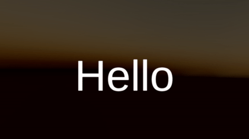

# Timelineによる映像制作

[『Unityゲーム プログラミング・バイブル 2nd Generation』](https://amzn.to/3oe2agf)の「No.08 Timelineによる映像制作」向けのサンプルプロジェクトです。

[TimelineTutorial/Assets/TimelineTutorial](TimelineTutorial/Assets/TimelineTutorial)に合計12個のサンプルシーンがあります。

少しずつ処理を加えることで、一歩ずつレベルアップしながら理解を深められるチュートリアル形式のサンプルシーンになっています。

## バージョン情報

- Unity 2020.1.8f1
- uRaymarching: v2.1.1
- Post-processing Stack（v2）2.3.0
- Timeline 1.3.6
- Cinemachine 2.6.3
- TextMeshPro 3.0.3
- Unity Recorder 2.5.2

## サンプルの完成形『Secret stage BOSS』

今回のサンプルの完成形の作品が『Secret stage BOSS』です。
自機やボスを登場させてシューティングゲームのようにアレンジしました。
GitHub上でUnityプロジェクトを公開しているので、もし興味があれば参考にしてください。

- [GitHub](https://github.com/gam0022/secret-stage-boss)
- [YouTube](https://youtu.be/srO7IxNckZ8)

## サンプル01 uRaymarchingの基本とセットアップ

シーン名: `uRaymarchingSphere`

uRaymarchingの導入から基本的な使い方を説明するサンプルです。

## サンプル02 距離関数の定義

シーン名: `uRaymarchingDistanceFunction`

Distance Function（距離関数）を書き換えて、シーンの形状を変更するサンプルです。

## サンプル03 マテリアル分けの定義

シーン名: `uRaymarchingPostEffect`

Post Effectはライティングに必要なマテリアルの設定を書き込むための関数です。
PostEffectOutputという構造体にサーフェースシェーダー相当の設定を書き込むことで、マテリアルの色分けができます。

## サンプル04 ReflectionProbeとの組み合わせ

シーン名: `uRaymarchingReflectionProbe`

uRaymarchingとReflectionProbeを組み合わせて、鏡面反射による映り込みを実現するサンプルです。

## サンプル05 Boxのプリミティブを組み合わせによる複雑なシーン

シーン名: `uRaymarchingGears`

単純なBoxのプリミティブを組み合わせから複雑な形状のシーンを作成するサンプルです。

## サンプル06 Post-processing Stackのセットアップ

シーン名: `PostProcessingSetup`

Post-processing Stackのセットアップ方法を学ぶためのサンプルです。

## サンプル07 カスタムエフェクトの追加（エフェクトの自作）

シーン名: `PostProcessingCustomEffect`

小さい画面がたくさん並ぶ「マルチスクリーン」の効果を加えるカスタムエフェクトを実装するサンプルです。
さらに画面のグリッドごとに色をカラフルにする効果も加えました。

## サンプル08 Animation Trackでアニメーションを設定

シーン名: `TimelineAnimationTrack`

Animation Trackをつかってレイマーチングのパラメーターをアニメーションをするサンプルです。
ギアの配置間隔のマテリアルのプロパティにキーを打つアニメーションを例にしました。

## サンプル09 Audio Trackでオーディオを再生

シーン名: `TimelineAudioTrack`

Audio Trackでオーディオを再生するサンプルです。

## サンプル10 Cinemachineでカメラワークを設定

シーン名: `CinemachineSetup`

Cinemachineでカメラワークを設定するサンプルです。

2つのVirtual CameraをTimeline上でブレンドすることにより、FOVを変化させる簡単なカメラワークを作成しています。

## サンプル11 Timelineのカスタムトラックの作成

シーン名: `CinemachineSetup`

Timelineのカスタムトラックの作成するサンプルです。
TextMeshProのテキストと色を変化する単純なカスタムトラックを例にしました。

## サンプル12 音楽と同期して演出をブラッシュアップ

シーン名: `BeatSync`

音楽のタイミングと演出のタイミングを同期させることで、より高度な演出を実装するサンプルです。

## ランセンスと著作権

- ソースコードのライセンスはMITです。
- 音楽素材の著作権は [@sadakkey](https://twitter.com/sadakkey) さんにあります。再利用はできません。